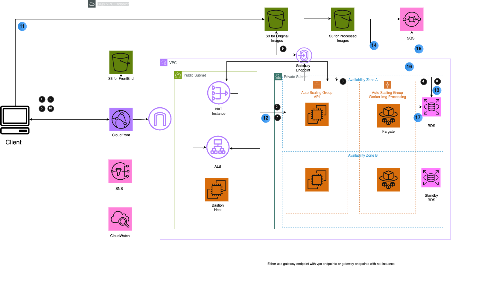

# AWSimageprocessing

## Overview

AWSimageprocessing is a cloud-native, scalable image processing platform built on AWS. It leverages Terraform for infrastructure as code and Python for application logic. The architecture is designed for high availability, security, and automation.

## Architecture

### Components

- **S3 Buckets**: For frontend assets, original images, and processed images.
- **CloudFront**: CDN for serving frontend and static assets.
- **NAT Instance**: Allows private subnet resources to access the internet securely.
- **ALB (Application Load Balancer)**: Distributes API traffic.
- **Bastion Host**: Secure SSH access to private resources.
- **Auto Scaling Groups**: For API and worker nodes.
- **Fargate**: Serverless compute for image processing workers.
- **RDS**: Managed relational database (with standby for HA).
- **SQS**: Message queue for decoupling processing tasks.
- **SNS**: Notifications and alerts.
- **CloudWatch**: Monitoring and logging.
- **VPC Endpoints**: Secure access to AWS services.

## Project Structure

- `environment/`: Terraform code for environment setup (VPC, S3, ASG, etc.)
- `modules/`: Reusable Terraform modules for AWS resources.
- `modules/terraform-aws-nat-instance/runonce.sh`: Script for NAT instance initialization.

## Deployment Plan

1. **Provision Infrastructure**: Use Terraform to deploy VPC, subnets, NAT, ALB, S3, RDS, SQS, SNS, CloudWatch, and endpoints.
2. **Deploy Application**: Build and deploy Python API and worker services (using ASG and Fargate).
3. **Configure Networking**: Ensure secure access via NAT, ALB, and Bastion.
4. **Monitor & Alert**: Set up CloudWatch dashboards and SNS notifications.
5. **Scale**: Use Auto Scaling Groups and Fargate for dynamic scaling.

## Getting Started

1. Clone the repository.
2. Configure AWS credentials.
3. Initialize and apply Terraform in the `environment/dev/` directory.
4. Deploy application code to the provisioned infrastructure.

## Notes

- No additional shell scripts are required at this stage.
- All infrastructure changes should be managed via Terraform.
- See module READMEs for specific resource details.